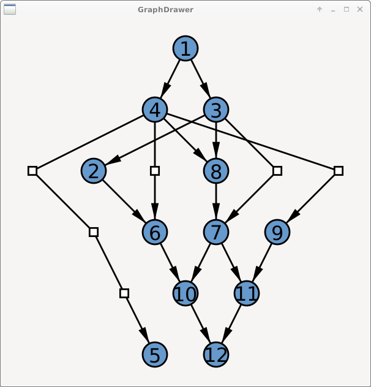

# pysugiyama
sugiyama directed graph layout visualisation in python

GNU GPL Free Graph layout rendering in python using sugiyama directed graph layout algorithm

This is based on https://github.com/KadaB/sugiyama

## Run
./graphs.py

## Dependencies
- PyGtk 3.0
- PyCairo

Takes graph like:

``
Edges = [(1, 3), (1, 4), (2, 6), (3, 2), (3, 7), (3, 8), (4, 5), (4, 6), (4, 8), (4, 9), (6, 10), (7, 10), (7,     ..11), (8, 7), (9, 11), (10, 12), (11, 12)]
``

and renders:

The drawing routines are done using cairo lib in graph.py  
The sugiyama algoritm is in sugiyama.py  
To add are priority or brander algorithm for better node placement  
And console version generating svg image  
And a parser or xml parser for dome graph data format  
